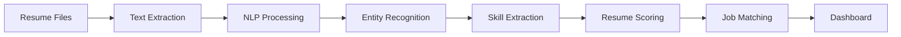

<div align="center">

# 📄 TalentLens AI

### Intelligent Resume Screening & Candidate Matching Platform

*An AI-powered recruitment platform that automates resume parsing, skill extraction, candidate scoring, and job matching using Natural Language Processing (NLP), Named Entity Recognition (NER), and semantic similarity techniques.*


</div>

---

# 📖 Overview

Recruiters often spend significant time manually reviewing resumes before identifying suitable candidates. Automating this process improves efficiency, reduces bias, and enables faster hiring decisions.

TalentLens AI demonstrates an end-to-end recruitment intelligence pipeline that extracts structured information from resumes, evaluates candidate profiles, matches skills against job requirements, and recommends the most suitable candidates through interactive analytics.

The project combines Natural Language Processing, Named Entity Recognition, semantic matching, and machine learning to streamline resume screening.

---

# ✨ Core Features

## 📄 Intelligent Resume Parsing

Automatically extract:

- Candidate Name
- Email Address
- Phone Number
- Skills
- Education
- Work Experience

---

## 🧠 NLP Entity Recognition

Powered by modern NLP techniques including:

- Named Entity Recognition (NER)
- Tokenization
- Text Cleaning
- Keyword Extraction

---

## 🎯 Skill Matching

Compare candidate profiles against job descriptions using:

- Semantic Similarity
- Fuzzy Matching
- Skill Taxonomy
- Keyword Matching

---

## 📊 Resume Scoring

Generate an overall candidate score based on:

- Technical Skills
- Experience
- Education
- Job Relevance
- Skill Coverage

---

## 💼 Job Recommendation

Recommend suitable roles based on:

- Skill Alignment
- Experience Level
- Resume Score
- Job Requirements

---

## 📈 Interactive Dashboard

Visualize:

- Resume Scores
- Skill Distribution
- Candidate Rankings
- Experience Timeline
- Skill Radar Charts

---

# 🏗 Recruitment Workflow



---

# 📊 AI Pipeline

The platform performs several stages of intelligent candidate evaluation.

### 📄 Resume Processing

- Resume Parsing
- Text Cleaning
- Tokenization
- Entity Recognition

---

### 🧠 Candidate Intelligence

Extract:

- Skills
- Experience
- Education
- Certifications
- Contact Information

---

### 🎯 Candidate Evaluation

Calculate:

- Resume Score
- Skill Match Percentage
- Job Compatibility
- Candidate Ranking

---

### 📈 Analytics Dashboard

Explore:

- Candidate Leaderboards
- Skill Coverage
- Experience Distribution
- Matching Accuracy
- Hiring Insights

---

# 📈 Performance

| Metric | Score |
|---------|-------:|
| Skill Extraction Accuracy | **92%** |
| Entity Recognition | **89%** |
| Job Match Precision | **85%** |
| Processing Speed | **2–5 sec / Resume** |

---

# 🛠 Technology Stack

| Category | Technology |
|-----------|------------|
| Programming | Python |
| NLP | spaCy, Transformers (BERT), NLTK |
| Text Matching | Regex, Fuzzy Matching, Levenshtein Distance |
| Data Processing | Pandas, NumPy |
| Database | SQLite |
| Visualization | Plotly |
| Dashboard | Streamlit |

---

# 📂 Repository Structure

```text
TalentLens-AI/
│
├── dashboard/
├── data/
├── src/
├── database/
├── train_model.py
├── requirements.txt
└── README.md
```

---

# 🎯 Skills Demonstrated

- Natural Language Processing
- Named Entity Recognition
- Resume Parsing
- Information Extraction
- Semantic Matching
- Fuzzy String Matching
- Candidate Ranking
- Machine Learning
- Dashboard Development
- HR Analytics

---

# 💼 Business Applications

TalentLens AI can support:

- 👨‍💼 Resume Screening
- 💼 Recruitment Automation
- 🎯 Candidate Ranking
- 🏢 HR Analytics
- 📊 Talent Intelligence
- 🤝 Job Recommendation
- 🚀 Recruitment Decision Support

---

# ⚙ Getting Started

Clone the repository:

```bash
git clone https://github.com/your-username/talentlens-ai.git
```

Install dependencies:

```bash
pip install -r requirements.txt
```

Train the NLP models:

```bash
python train_model.py
```

Launch the dashboard:

```bash
streamlit run dashboard/app.py
```

---

# 💡 Why This Project?

Recruitment increasingly relies on AI to process large volumes of resumes efficiently while maintaining consistency and transparency.

TalentLens AI demonstrates how Natural Language Processing, Named Entity Recognition, semantic matching, and intelligent scoring can be combined into an end-to-end recruitment platform that helps organizations identify qualified candidates faster and make more informed hiring decisions.
